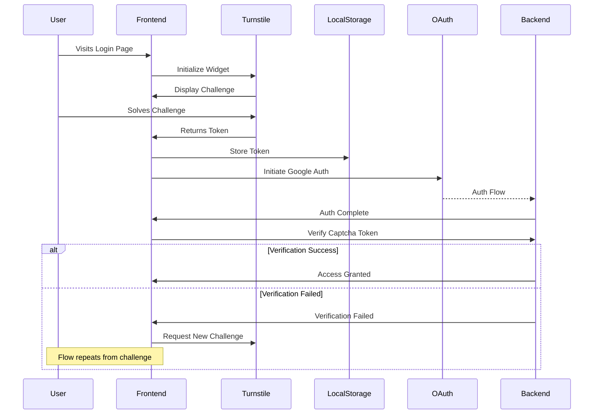

# Captcha Implementation

## Overview

Cloudflare Turnstile provides bot protection through CAPTCHA challenges. The implementation ensures legitimate user access while preventing automated abuse.

## Architecture

## Implementation Details

1. Frontend Integration
   - Turnstile React component integration in login page
   - Token storage in localStorage for persistence during OAuth flow
   - Disabled login button until CAPTCHA completion

2. Security Measures
   - Server-side token verification
   - Token expiration handling
   - One-time use enforcement

3. User Flow
   - User must complete CAPTCHA before OAuth
   - Token verification occurs after successful OAuth
   - Failed verification prompts new CAPTCHA challenge

## Code Structure

1. Login Page Component
   - CAPTCHA widget integration
   - Token state management
   - OAuth flow handling

2. Backend Verification
   - Token validation endpoint
   - Integration with authentication pipeline
   - Security policy enforcement

## Configuration

Required environment variables:
- NEXT_PUBLIC_TURNSTILE_SITE_KEY: Public site key for widget
- TURNSTILE_SECRET_KEY: Server-side verification key
