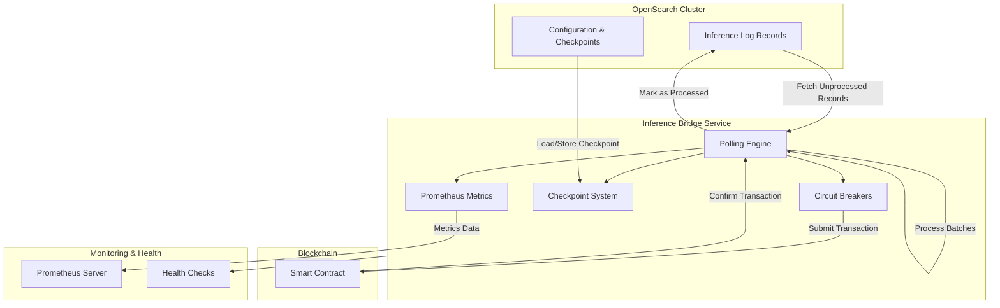

# Inference Bridge

A resilient service that bridges inference logs from OpenSearch to blockchain, enabling on-chain verification of AI model usage.

## Overview

Inference Bridge polls OpenSearch for inference log records, processes them in batches, and submits the data to a smart contract on the blockchain. This creates an immutable record of AI model usage while ensuring efficient processing through configurable batching.

## Architecture



The service consists of the following components:

- **Poller**: Core engine that fetches and processes records
- **Circuit Breakers**: Prevent cascading failures when external services are unavailable
- **Prometheus Metrics**: Provide operational visibility
- **Checkpoint System**: Ensures reliable resumption after restarts
- **Configuration System**: Centralized configuration in OpenSearch

## Prerequisites

- Node.js 18+
- Access to an OpenSearch cluster
- Access to blockchain RPC endpoints
- Private key with sufficient funds for transactions

## Installation

```bash
# Clone the repository
git clone <repository-url>
cd inference-bridge

# Install dependencies
yarn install
```

## Configuration

Configure the service via environment variables:

| Variable              | Description                               | Default                                          |
| --------------------- | ----------------------------------------- | ------------------------------------------------ |
| `OPENSEARCH_ENDPOINT` | OpenSearch endpoint URL                   | (required)                                       |
| `OPENSEARCH_USERNAME` | OpenSearch username                       | (required)                                       |
| `OPENSEARCH_PASSWORD` | OpenSearch password                       | (required)                                       |
| `OPENSEARCH_INDEX`    | Index containing inference logs           | "your-index"                                     |
| `BATCH_SIZE`          | Number of records to process per batch    | 100                                              |
| `POLL_INTERVAL_MS`    | Polling interval in milliseconds          | 60000                                            |
| `RPC_URL_HTTP`        | Blockchain RPC HTTP URL                   | "https://rpc-test0-two-zepe2m25hg.t.conduit.xyz" |
| `RPC_URL_WS`          | Blockchain RPC WebSocket URL              | "wss://rpc-test0-two-zepe2m25hg.t.conduit.xyz"   |
| `SIGNER_PRIVATE_KEY`  | Private key for transaction signing       | (required)                                       |
| `APP_ID`              | Application identifier for smart contract | "Klok"                                           |
| `LOG_LEVEL`           | Logging level                             | "info"                                           |

## API Endpoints

### Health Check

Returns health status of the service and its dependencies.

**Example Response:**

```json
{
  "status": "ok",
  "components": {
    "poller": "up",
    "opensearch": "up"
  }
}
```

### Metrics

Provides Prometheus metrics for monitoring.

**Endpoint:**

```markdown
GET /metrics
```

```
# HELP inference_bridge_records_processed_total Total number of inference records processed
# TYPE inference_bridge_records_processed_total counter
inference_bridge_records_processed_total 1275

# HELP inference_bridge_batches_processed_total Total number of batches processed
# TYPE inference_bridge_batches_processed_total counter
inference_bridge_batches_processed_total 15

# HELP inference_bridge_up Whether the poller is running (1) or not (0)
# TYPE inference_bridge_up gauge
inference_bridge_up 1

# HELP inference_bridge_processing_duration_seconds Duration of processing cycles in seconds
# TYPE inference_bridge_processing_duration_seconds histogram
inference_bridge_processing_duration_seconds_bucket{le="0.1"} 2
inference_bridge_processing_duration_seconds_bucket{le="0.5"} 8
inference_bridge_processing_duration_seconds_bucket{le="1"} 12
// ...additional metrics...
```
