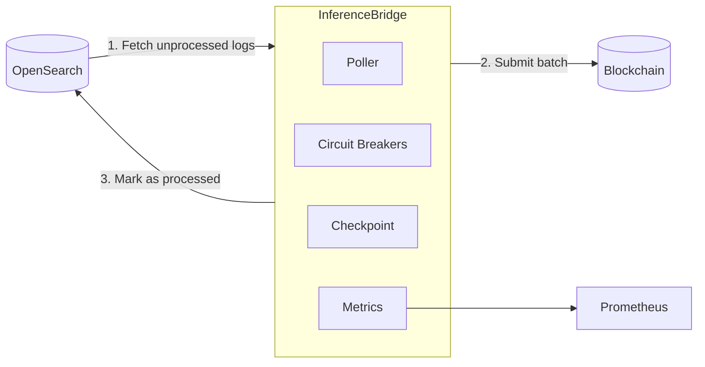

# Inference Bridge

A resilient service that bridges inference logs from OpenSearch to blockchain, enabling on-chain verification of AI model usage.

## Overview

Inference Bridge polls OpenSearch for inference log records, processes them in batches, and submits the data to a smart contract on the blockchain. This creates an immutable record of AI model usage while ensuring efficient processing through configurable batching.

## Architecture



The service consists of the following components:

- **Poller**: Core engine that fetches and processes records
- **Circuit Breakers**: Prevent cascading failures when external services are unavailable
- **Prometheus Metrics**: Provide operational visibility
- **Checkpoint System**: Ensures reliable resumption after restarts
- **Configuration System**: Centralized configuration in OpenSearch

## Prerequisites

- Node.js 18+
- Access to an OpenSearch cluster
- Access to blockchain RPC endpoints
- Private key with sufficient funds for transactions

## Installation

```bash
# Clone the repository
git clone <repository-url>
cd inference-bridge

# Install dependencies
yarn install
```

## Configuration

Configure the service via environment variables:

| Variable              | Description                               | Default                                          |
| --------------------- | ----------------------------------------- | ------------------------------------------------ |
| `OPENSEARCH_ENDPOINT` | OpenSearch endpoint URL                   | (required)                                       |
| `OPENSEARCH_USERNAME` | OpenSearch username                       | (required)                                       |
| `OPENSEARCH_PASSWORD` | OpenSearch password                       | (required)                                       |
| `OPENSEARCH_INDEX`    | Index containing inference logs           | "your-index"                                     |
| `BATCH_SIZE`          | Number of records to process per batch    | 100                                              |
| `POLL_INTERVAL_MS`    | Polling interval in milliseconds          | 60000                                            |
| `RPC_URL_HTTP`        | Blockchain RPC HTTP URL                   | "https://rpc-test0-two-zepe2m25hg.t.conduit.xyz" |
| `RPC_URL_WS`          | Blockchain RPC WebSocket URL              | "wss://rpc-test0-two-zepe2m25hg.t.conduit.xyz"   |
| `SIGNER_PRIVATE_KEY`  | Private key for transaction signing       | (required)                                       |
| `APP_ID`              | Application identifier for smart contract | "Klok"                                           |
| `LOG_LEVEL`           | Logging level                             | "info"                                           |

## API Endpoints

### Health Check

```
GET /health
```

Returns health status of the service and its dependencies.

**Example Response:**

```json
{
  "status": "ok",
  "components": {
    "poller": "up",
    "opensearch": "up"
  }
}
```

### Metrics

```
GET /metrics
```

Provides Prometheus metrics for monitoring.

**Example Response:**

```
# HELP inference_bridge_records_processed_total Total number of inference records processed
# TYPE inference_bridge_records_processed_total counter
inference_bridge_records_processed_total 1275

# HELP inference_bridge_batches_processed_total Total number of batches processed
# TYPE inference_bridge_batches_processed_total counter
inference_bridge_batches_processed_total 15

# HELP inference_bridge_up Whether the poller is running (1) or not (0)
# TYPE inference_bridge_up gauge
inference_bridge_up 1

# HELP inference_bridge_processing_duration_seconds Duration of processing cycles in seconds
# TYPE inference_bridge_processing_duration_seconds histogram
inference_bridge_processing_duration_seconds_bucket{le="0.1"} 2
inference_bridge_processing_duration_seconds_bucket{le="0.5"} 8
inference_bridge_processing_duration_seconds_bucket{le="1"} 12
// ...additional metrics...
```

## Development

### Running Locally

```bash
# Development mode with hot reload
yarn dev

# Production mode
yarn build:ts
yarn start
```

### Testing

```bash
# Run tests
yarn test
```

## High Availability Design

The service is designed for high availability and resilience:

1. **Circuit Breakers**: Prevent cascading failures for both OpenSearch and blockchain connections
2. **Resilient Checkpointing**: OpenSearch-based checkpoints ensure reliable resumption after failures
3. **Idempotent Processing**: In-memory cache prevents duplicate processing even with OpenSearch latency
4. **Exponential Backoff**: Smart retry strategy for transient failures
5. **Prometheus Metrics**: Detailed operational insights for monitoring and alerting
6. **Health Endpoints**: Comprehensive health checking for load balancer integration
7. **Graceful Shutdown**: Safe termination to prevent data loss

## Deployment

### Docker

The service is designed to run in containerized environments:

```bash
# Build Docker image
docker build -t inference-bridge .

# Run with Docker
docker run -p 3000:3000 \
  -e OPENSEARCH_ENDPOINT=https://your-endpoint \
  -e OPENSEARCH_USERNAME=username \
  -e OPENSEARCH_PASSWORD=password \
  -e OPENSEARCH_INDEX=your-index \
  -e SIGNER_PRIVATE_KEY=0x123456789... \
  inference-bridge
```

### AWS Fargate Deployment

When deploying to AWS Fargate, configure the following:

1. Set all required environment variables in the task definition
2. Ensure proper IAM permissions for service operation
3. Configure health checks using the `/health` endpoint
4. Set up Prometheus scraping for the `/metrics` endpoint
5. Configure proper logging to CloudWatch
6. Set memory and CPU allocations based on batch size

## Troubleshooting

Common issues and solutions:

| Issue                           | Possible Cause                              | Solution                                          |
| ------------------------------- | ------------------------------------------- | ------------------------------------------------- |
| OpenSearch Connection Errors    | Invalid credentials or network connectivity | Verify credentials and network settings           |
| Blockchain Transaction Failures | Insufficient funds or incorrect private key | Ensure the private key has sufficient funds       |
| Service Not Processing Records  | Circuit breaker might be open               | Check logs and metrics for circuit breaker status |
| High Memory Usage               | Large batches or uncontrolled caching       | Reduce batch size or adjust memory allocation     |
| Duplicate Record Processing     | OpenSearch indexing latency                 | Ensure the in-memory cache is sufficient          |

## Monitoring

Monitor the following Prometheus metrics:

- `inference_bridge_up`: Service availability (0/1)
- `inference_bridge_records_processed_total`: Total processed records count
- `inference_bridge_batches_processed_total`: Number of batches processed
- `inference_bridge_errors_total`: Error count for alerting
- `inference_bridge_processing_duration_seconds`: Processing time histogram
- `inference_bridge_circuit_breaker_opensearch`: OpenSearch circuit breaker state
- `inference_bridge_circuit_breaker_blockchain`: Blockchain circuit breaker state

Recommended alerts:

- When `inference_bridge_up` is 0 for more than 5 minutes
- When `inference_bridge_errors_total` increases rapidly
- When circuit breakers enter OPEN state

## License

[MIT License](LICENSE)

```

This version includes all the detailed sections from the previous version while keeping the improved mermaid diagram.

Made changes.
```
